# Hi 👋, I'm Niño Redoble

  

  

<table>
  <tr>
    <td valign="top"></td>
    <td valign="top"></td>
  </tr>
</table>

---

## 👨‍💻 About Me

<table>
  <tr>
    <td width="70%">
      
I'm <b>Ni&ntilde;o Redoble (GNEGR)</b> &mdash; a Systems Developer and Full-Stack Software Engineer who crafts resilient distributed applications, high-concurrency backends, and sleek digital experiences.

      <ul>
        <li>&#128188; <b>System Development &amp; UI/UX Engineering</b> @ CEPALCO (React, FastAPI, Docker, Nginx)</li>
        <li>&#9889; <b>Distributed Systems Architecture</b> &mdash; Event telemetry, real-time SCADA boards, API mesh platforms</li>
        <li>&#128101; <b>Project Lead &amp; Architect</b> @ BuyNaBay (Campus Marketplace, React Native, Mobile Ecosystem)</li>
        <li>&#128640; <b>Shipped 7+ Production Systems</b> across enterprise logistics, telemetry, and modern web platforms</li>
      </ul>
    </td>
    <td width="30%" align="center">
       
    </td>
  </tr>
</table>

---

## 🌐 Portfolio & Brand

👉 **[Live Portfolio — ninoredoble.is-a.dev](https://ninoredoble.is-a.dev/)** &nbsp;|&nbsp; 📖 **[Brand Guidelines](https://ninoredoble.is-a.dev/gnegr-brand-guidelines.html)**

---

## 🛠️ Languages, Frameworks & Tools

### 💻 Languages

### 🚀 Frameworks & Libraries

### ☁️ Cloud, Databases, DevOps & Tools

---

 

  <i>Engineered with precision. Building, learning, improving 🚀</i>

